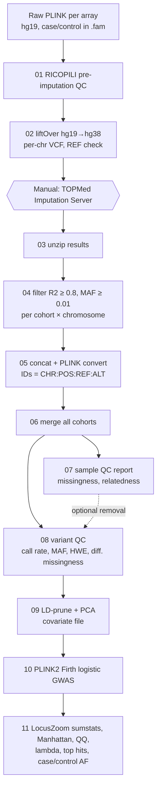

# GWAS Pipeline: Corticobasal Degeneration (CBD)

A reproducible, end-to-end pipeline for a case/control genome-wide association study
that combines several genotyping arrays:

**raw PLINK genotypes → RICOPILI QC → hg38 liftover → TOPMed imputation → per-cohort filtering → merge → sample & variant QC → PCA → Firth logistic GWAS → summary statistics & plots**

It was built for a CBD GWAS (220 neuropathologically confirmed CBD cases from 2 case batches and
4,878 controls from 4 control arrays), but all inputs, thresholds and cluster settings live in two config
files, so it can be reused for any multi-array case/control study.

---

## Contents

- [Pipeline overview](#pipeline-overview)
- [Requirements](#requirements)
- [Repository layout](#repository-layout)
- [Quick start](#quick-start)
- [Configuration](#configuration)
- [Step-by-step guide](#step-by-step-guide)
  - [Step 01: Pre-imputation QC (RICOPILI)](#step-01--pre-imputation-qc-ricopili)
  - [Step 02: Liftover to hg38 and TOPMed VCFs](#step-02--liftover-to-hg38-and-topmed-vcfs)
  - [⏸ Impute on the TOPMed Imputation Server (manual)](#-impute-on-the-topmed-imputation-server-manual)
  - [Step 03: Unzip TOPMed results](#step-03--unzip-topmed-results)
  - [Step 04: Filter imputed variants](#step-04--filter-imputed-variants)
  - [Step 05: Convert each cohort to PLINK](#step-05--convert-each-cohort-to-plink)
  - [Step 06: Merge cohorts](#step-06--merge-cohorts)
  - [Step 07: Sample QC report](#step-07--sample-qc-report)
  - [Step 08: Variant QC](#step-08--variant-qc)
  - [Step 09: PCA and covariates](#step-09--pca-and-covariates)
  - [Step 10: Firth logistic GWAS](#step-10--firth-logistic-gwas)
  - [Step 11: Post-GWAS outputs](#step-11--post-gwas-outputs)
- [Running alternative QC settings](#running-alternative-qc-settings)
- [Utilities](#utilities)
- [Cohort-specific notes and troubleshooting](#cohort-specific-notes-and-troubleshooting)
- [Data protection](#data-protection)
- [Software and citations](#software-and-citations)

---

## Pipeline overview



| Step | Script | Runs as | Approx. wall time* |
|---|---|---|---|
| 01 | `scripts/01_preimputation_qc_ricopili.sh` | login node (RICOPILI submits jobs) | 1–2 h per cohort |
| 02 | `scripts/02_prepare_topmed_vcfs.sh` | LSF array, 1 task / cohort | < 1 h |
| ⏸ | TOPMed Imputation Server | web upload | hours to days |
| 03 | `scripts/03_unzip_topmed_results.sh` | LSF array, cohort × chr | minutes |
| 04 | `scripts/04_filter_imputed.sh` | LSF array, cohort × chr | < 1 h |
| 05 | `scripts/05_convert_cohort.sh` | LSF array, 1 task / cohort | 2–6 h |
| 06 | `scripts/06_merge_cohorts.sh` | single job | 1–3 h |
| 07 | `scripts/07_sample_qc.sh` | single job | ~1 h |
| 08 | `scripts/08_variant_qc.sh` | single job | ~1 h |
| 09 | `scripts/09_pca_covariates.sh` | single job | < 30 min |
| 10 | `scripts/10_gwas_firth.sh` | single job | ~20–60 min |
| 11 | `scripts/11_post_gwas.sh` | single job | ~5 min |

\*Rough guide for ~7,600 samples and ~9 M imputed variants on Minerva (Mount Sinai); the Firth GWAS on 4.7 M variants took 21 min with 8 threads.

---

## Requirements

| Tool | Version used | Purpose |
|---|---|---|
| [RICOPILI](https://sites.google.com/a/broadinstitute.org/ricopili/) | 2025 (`ricopili_dependencies_0225b`) | pre-imputation QC |
| [UCSC liftOver](https://genome.ucsc.edu/cgi-bin/hgLiftOver) + `hg19ToHg38.over.chain.gz` | 24-Jan-2025 | coordinate conversion |
| [PLINK 1.9](https://www.cog-genomics.org/plink/) | 1.90b6.21 | merge, LD pruning, IBD |
| [PLINK 2](https://www.cog-genomics.org/plink/2.0/) | v2.00a5.14 | conversion, QC, PCA, Firth GWAS |
| [bcftools / htslib](https://www.htslib.org/) | 1.22 | VCF handling |
| [7-Zip](https://www.7-zip.org/) (`7zz`) | p7zip module | TOPMed archives |
| R + [`data.table`](https://cran.r-project.org/package=data.table) | 4.4.1 | covariates, plots |
| hg38 reference FASTA (UCSC naming, `chr1` …) | – | REF allele check |
| IBM LSF (`bsub`) | – | job scheduling (scripts also run interactively) |

On Minerva everything is available through `module load`. Module names are set in
`config/config.sh`, so other clusters only need that file edited.

---

## Repository layout

```
GWAS-Pipeline/CBD_TOPMed_GWAS/
├── README.md
├── run_pipeline.sh                    # submits steps to LSF with job dependencies
├── config/
│   ├── config.example.sh              # all paths, modules and thresholds (copy → config.sh)
│   ├── cohorts.example.tsv            # one row per genotyping array (copy → cohorts.tsv)
│   ├── topmed_passwords.example.tsv   # format for TOPMed zip passwords (copy → topmed_passwords.tsv)
│   └── chr_rename.txt                 # 1 → chr1 … for hg38 VCFs
└── scripts/
    ├── lib/common.sh                  # config loading, logging, cohort lookups
    ├── 01_preimputation_qc_ricopili.sh
    ├── 02_prepare_topmed_vcfs.sh
    ├── 03_unzip_topmed_results.sh
    ├── 04_filter_imputed.sh
    ├── 05_convert_cohort.sh
    ├── 06_merge_cohorts.sh
    ├── 07_sample_qc.sh
    ├── 08_variant_qc.sh
    ├── 09_pca_covariates.sh
    ├── 10_gwas_firth.sh
    ├── 11_post_gwas.sh
    ├── build_covariates.R             # used by step 09
    ├── plot_gwas.R                    # used by step 11
    └── utils/
        ├── count_imputed_variants.sh      # variants before/after imputation filter
        └── lookup_imputation_quality.sh   # MAF/R2 of chosen SNPs in every cohort
```

No data is stored in the repository. All inputs and outputs live under `PROJECT_DIR`
(see [Data protection](#data-protection)).

---

## Quick start

```bash
# 1. get the code
git clone https://github.com/Center-for-ComputationalNeuropathology/GWAS-Pipeline.git
cd GWAS-Pipeline/CBD_TOPMed_GWAS

# 2. create your local (git-ignored) configuration
cp config/config.example.sh  config/config.sh
cp config/cohorts.example.tsv config/cohorts.tsv
cp config/topmed_passwords.example.tsv config/topmed_passwords.tsv && chmod 600 config/topmed_passwords.tsv
#    → edit paths, cohorts and thresholds

# 3. pre-imputation
scripts/01_preimputation_qc_ricopili.sh all       # wait for RICOPILI jobs to finish
./run_pipeline.sh 02                              # writes TOPMed-ready VCFs

# 4. impute on TOPMed (manual), download results to IMPUTED_DIR/<cohort>/

# 5. everything after imputation, chained on LSF
./run_pipeline.sh --dry-run 03-11                 # inspect the bsub commands first
./run_pipeline.sh 03-11
```

Any step can also be run interactively, e.g. `bash scripts/08_variant_qc.sh`, or for array
steps with an explicit task index: `bash scripts/04_filter_imputed.sh 23` (cohort 2, chr1).

---

## Configuration

### `config/config.sh`

Every step sources this file. The most important settings:

| Variable | Example | Meaning |
|---|---|---|
| `PROJECT_DIR` | `/sc/arion/projects/.../CBD_GWAS_ricopili` | data root (outside the repo) |
| `RAW_DIR` | `${PROJECT_DIR}/cohorts` | raw PLINK + RICOPILI `qc/` folders |
| `PREP_DIR` | `${PROJECT_DIR}/imputation_prep` | VCFs for TOPMed upload |
| `IMPUTED_DIR` | `${PROJECT_DIR}/Imputed_files_TopMed` | TOPMed downloads, one sub-folder per cohort |
| `WORK_DIR` | `${PROJECT_DIR}/pipeline_output` | all post-imputation outputs |
| `SAMPLE_METADATA` | `.../covariates.txt` | phenotype and covariates (see below) |
| `IMPUTE_R2`, `IMPUTE_MAF` | `0.8`, `0.01` | step 04 filters |
| `QC_GENO`, `QC_MAF`, `QC_HWE` | `0.02`, `0.02`, `1e-6` | step 08 filters |
| `QC_SEPARATE_GENO` | *(empty)* or `0.01` | call-rate filter applied within cases and controls separately |
| `QC_DIFFMISS` | `0.05` | max missingness allowed in cases **or** controls |
| `APPLY_SAMPLE_QC` | `false` | remove `--mind` failures and relatives in step 08 |
| `GWAS_COVARS` | `Sex,PC1,PC2,PC3,PC4,PC5` | covariates in the association model |
| `RUN_TAG` | `geno02_maf02_hwe1e6_dm` | names QC/GWAS output folders; change it per parameter set |

To use a different config file: `CONFIG_FILE=/path/to/other.sh ./run_pipeline.sh 08-11`.

### `config/cohorts.tsv`

One row per genotyping batch (tab-separated). The first row is the merge base.

```tsv
#cohort      raw_dir        raw_bfile           qc_prefix              description
CBD          CBD            cbd_69_pheno        cbd_cbd1_eur_sk-qc1    69 new CBD cases (GSA array)
CBD_2        CBD_GWAS_2     v5cbd               cbd_cbd1_eur_sk-qc1    152 Mayo CBD cases
GSA          gsa            gsa_pheno           cbd_gsa1_eur_sk-qc1    GSA-array controls
Illumina     illumina       illumina_pheno      cbd_illu1_eur_sk-qc1   Illumina-array samples
Express      express        express_pheno       cbd_expr1_eur_sk-qc1   Express-array controls
ExpressExome expressExome   expressExome_pheno  cbd_exex1_eur_sk-qc1   ExpressExome-array controls
```

The `cohort` name is also the TOPMed results sub-folder (`IMPUTED_DIR/<cohort>/`) and the prefix of
every per-cohort output file.

### Sample metadata (`SAMPLE_METADATA`)

Whitespace-delimited with a header. `FID`, `IID` and `PHENO` are required. Any other columns
can be used as covariates.

```
FID  IID          CHIP  Age  Sex  PHENO
0    SAMPLE_0001  2     58   2    1
0    SAMPLE_0002  1     71   1    0
0    SAMPLE_0003  NA    NA   2    1
```

- `PHENO`: `1` = case, `0` = control, `NA` = excluded from the GWAS.
- `Sex`: `1` = male, `2` = female.
- Samples not listed in the metadata are genotyped and QC'd but not tested.
- `FID` must match the genotype files. After TOPMed imputation and PLINK2 conversion FIDs are `0`.

---

## Step-by-step guide

Paths below use the config variables. `<cohort>` is a row of `cohorts.tsv`.

### Step 01: Pre-imputation QC (RICOPILI)

**Why:** remove poorly genotyped samples/SNPs, sex mismatches, heterozygosity outliers and
HWE failures in each array **before** imputation. Bad input SNPs degrade imputation of the
whole surrounding region.

```bash
scripts/01_preimputation_qc_ricopili.sh GSA      # one cohort
scripts/01_preimputation_qc_ricopili.sh all      # every cohort in cohorts.tsv
```

On the first run in a cohort folder, `preimp_dir` creates `cbd.names`. Set a 5-character
`STUDYNAME` there (e.g. `gsa1`) and rerun:

```
STUDYNAME  BFILE      QCCYCLE  EXCLUDE
gsa1       gsa_pheno  1        0
```

| | |
|---|---|
| **Input** | `RAW_DIR/<raw_dir>/<raw_bfile>.{bed,bim,fam}` (hg19; affection status in column 6) |
| **Output** | `RAW_DIR/<raw_dir>/qc/<qc_prefix>.{bed,bim,fam}`, QC report `<qc_prefix>.pdf`, summary `<qc_prefix>.meta` |
| **Filters** | sample call rate ≥ 98 %, SNP call rate ≥ 98 %, \|F<sub>het</sub>\| < 0.2, case–control missingness difference < 2 %, HWE p > 10⁻⁶ (controls) / 10⁻¹⁰ (cases), sex check |

Example (`qc/cbd_cbd1_eur_sk-qc1.meta`):
```
ncases_preqc    69      ncases_postqc   69
nsnps_preqc     201694  nsnps_postqc    201694
```

### Step 02: Liftover to hg38 and TOPMed VCFs

**Why:** the TOPMed reference panel is on GRCh38 and the server only accepts per-chromosome,
bgzipped, sorted VCFs whose REF allele matches the reference genome.

```bash
./run_pipeline.sh 02                                 # all cohorts as an LSF array
bash scripts/02_prepare_topmed_vcfs.sh 3             # or one cohort (row 3 = GSA)
```

What it does, per cohort:
1. Autosomal SNPs → UCSC BED → `liftOver` hg19→hg38. Unmappable SNPs and SNPs that land on non-autosomal contigs are dropped.
2. `.bim` rewritten with hg38 positions, then `plink2 --sort-vars` (fixes "split chromosome" errors) and `--rm-dup exclude-mismatch`.
3. Per chromosome: VCF export → `bcftools sort` → rename `1`→`chr1` → `bcftools norm -m -any --check-ref ws` (splits multi-allelics, swaps REF/ALT to match hg38) → `tabix`.

| | |
|---|---|
| **Input** | `RAW_DIR/<raw_dir>/qc/<qc_prefix>` |
| **Output** | `PREP_DIR/<cohort>/<cohort>_chr{1..22}.vcf.gz` + `.tbi` (upload these). Also `<cohort>_unmapped.bed` and `<cohort>_hg38_dedup.{pgen,pvar,psam}` |

Example (GSA cohort):
```
autosomal input variants: 650522
lifted: 650296  unmapped: 226        # 650,120 remain on autosomes after liftover
```

### ⏸ Impute on the TOPMed Imputation Server (manual)

This step is done in the browser. The pipeline pauses here.

1. Log in at **<https://imputation.biodatacatalyst.nhlbi.nih.gov>**.
2. **Run → Genotype Imputation (Minimac4)**. Create **one job per cohort** (arrays must not be mixed in one job):

   | Setting | Value |
   |---|---|
   | Reference panel | TOPMed (latest release, e.g. r3) |
   | Input files | `PREP_DIR/<cohort>/<cohort>_chr*.vcf.gz` (all 22) |
   | Array build | **GRCh38/hg38** |
   | rsq filter | off (filtering happens in step 04) |
   | Phasing | Eagle v2.4 |
   | Population | vs. TOPMed panel / All |
   | Mode | Quality Control & Imputation |

3. Check the QC report the server emails (strand flips, allele mismatches, chunks excluded for low call rate).
4. Download every `chr_<N>.zip` into `IMPUTED_DIR/<cohort>/`, using `curl`/`wget` commands from the results page.
5. Add the zip password from the server's email to `config/topmed_passwords.tsv`:
   ```
   GSA	<password-from-email>
   ```

The original analysis was imputed with Minimac v4.1.6, with output in GRCh38 and full phasing.
**Record the panel version and job IDs in your lab notebook.**

### Step 03: Unzip TOPMed results

```bash
./run_pipeline.sh 03                      # n_cohorts × 22 tasks
```

| | |
|---|---|
| **Input** | `IMPUTED_DIR/<cohort>/chr_<N>.zip`, `config/topmed_passwords.tsv` |
| **Output** | `IMPUTED_DIR/<cohort>/chr<N>.dose.vcf.gz`, `chr<N>.info.gz`, `chr<N>.empiricalDose.vcf.gz` |

Passwords are read inside each job from the git-ignored file. They never appear in `bjobs`, logs or
the repository. Already-extracted chromosomes are skipped.

### Step 04: Filter imputed variants

**Why:** poorly imputed variants (low R²) and rare variants are unreliable, especially when
cases and controls come from different arrays. Filtering each cohort with the **same**
thresholds keeps imputation quality comparable across batches.

```bash
./run_pipeline.sh 04
```

```bash
bcftools view -i "MAF>=0.01 & R2>=0.8" chr17.dose.vcf.gz -Oz -o GSA_chr17_filtered.vcf.gz
```

| | |
|---|---|
| **Input** | `IMPUTED_DIR/<cohort>/chr<N>.dose.vcf.gz` |
| **Output** | `WORK_DIR/filtered_vcf/<cohort>_chr<N>_filtered.vcf.gz(.csi)` |

Check how much survived with `scripts/utils/count_imputed_variants.sh` (see [Utilities](#utilities)).

### Step 05: Convert each cohort to PLINK

```bash
./run_pipeline.sh 05
```

1. `bcftools concat` chr1–22 → one VCF per cohort.
2. `plink2 --vcf ... dosage=DS --make-pgen` keeps imputed dosages.
3. `--set-all-var-ids @:#:$r:$a` gives every variant a unique `CHR:POS:REF:ALT` ID that is identical across cohorts (e.g. `17:45948522:C:A`).
4. `--make-bed` writes hard calls for the PLINK 1.9 merge.

| | |
|---|---|
| **Output** | `WORK_DIR/per_cohort/<cohort>.{pgen,pvar,psam}` (dosages), `<cohort>_bed.{bed,bim,fam}` (hard calls) |

Example (variants per cohort after R² ≥ 0.8, MAF ≥ 0.01):
```
CBD           69 samples   7,272,766 variants
CBD_2        152 samples   7,422,938 variants
GSA        2,320 samples   8,091,298 variants
Illumina   1,914 samples   8,147,473 variants
Express    1,745 samples   8,227,436 variants
ExpressExome 1,564 samples 8,158,630 variants
```

### Step 06: Merge cohorts

```bash
./run_pipeline.sh 06
```

- PLINK 1.9 `--merge-list` takes the **union** of variants. A variant absent from a cohort becomes missing for that cohort's samples. Steps 07–08 handle this.
- If PLINK reports variants with > 2 alleles across cohorts (`*-merge.missnp`), they are excluded from every cohort and the merge is retried automatically.
- `merged/duplicate_ids.txt` lists sample IDs present in more than one cohort. PLINK merges them into one sample (see [notes](#cohort-specific-notes-and-troubleshooting)).

| | |
|---|---|
| **Output** | `WORK_DIR/merged/AllCohorts_merged_raw.{bed,bim,fam}` |

Example: `merged: 7613 samples, 9094130 variants`.

### Step 07: Sample QC report

```bash
./run_pipeline.sh 07
```

| Output (`WORK_DIR/sample_qc/`) | Content |
|---|---|
| `sample_missingness.smiss` | per-sample missing rate |
| `fail_mind.txt` | samples with missingness > `QC_MIND` (0.1) |
| `related_pairs.genome` | pairs with PI_HAT > `IBD_PIHAT` (0.2) on LD-pruned common SNPs |
| `samples_to_remove.txt` | `fail_mind` + one sample per related pair |

**Removal is opt-in** (`APPLY_SAMPLE_QC=true`). After the union merge, samples from sparser
arrays have systematically higher missingness. In this dataset all 69 GSA-array CBD cases
exceed 10 % missingness, so a blanket `--mind 0.1` would delete an entire case batch.
Batch-driven missingness is removed at the variant level instead (step 08, differential
missingness). Always review `related_pairs.genome`. PI_HAT ≈ 1 means a duplicate sample, ≈ 0.5 a
first-degree relative.

### Step 08: Variant QC

```bash
./run_pipeline.sh 08
```

Filters are applied in this order, and `qc_summary.tsv` records the count after each one:

| Filter | Config | Rationale |
|---|---|---|
| a) call rate | `QC_GENO=0.02` (or `QC_SEPARATE_GENO`) | removes variants missing in whole batches |
| b) MAF + HWE | `QC_MAF=0.02`, `QC_HWE=1e-6` | rare variants have little power with 220 cases; HWE flags genotyping/imputation errors |
| c) differential missingness | `QC_DIFFMISS=0.05` | drops variants with > 5 % missingness in cases **or** controls, which removes array-coverage artefacts |

Example `qc_summary.tsv` (default settings):
```
step         samples  variants
merged_raw   7613     9094130
a_callrate   7613     5958967
b_maf_hwe    7613     5194760
c_diffmiss   7613     4708354
```

| | |
|---|---|
| **Output** | `WORK_DIR/qc_<RUN_TAG>/AllCohorts_qc.{bed,bim,fam}`, `exclude_diffmiss.txt`, `qc_summary.tsv` |

> HWE is tested on all samples together (PLINK2 default with no phenotype loaded). The
> RICOPILI step already applied HWE in controls only, per array, before imputation.

### Step 09: PCA and covariates

```bash
./run_pipeline.sh 09
```

1. LD pruning: `plink --indep-pairwise 200 50 0.25` (≈ 230 k independent SNPs).
2. `plink2 --pca 10` on the pruned set. PCs capture ancestry **and** residual array/batch structure.
3. `scripts/build_covariates.R` joins `SAMPLE_METADATA` with the PCs (by IID) and writes `covariates.txt`.
4. `pca_plots.pdf`: PC1 vs PC2 and PC2 vs PC3, coloured by phenotype and by `CHIP`.

```
metadata samples : 5098
PCA samples      : 7613
merged           : 5098

PHENO (1 = case, 0 = control):
   0    1
4878  220
```

`covariates.txt`:
```
FID  IID          CHIP  Age  Sex  PC1        PC2       ...  PC10      PHENO
0    SAMPLE_0001  2     58   2    -0.00552   0.00108   ...  0.00084   1
```

Check `pca_plots.pdf` before running the GWAS. Cases and controls should overlap
within each array. Clear separation by `CHIP` that the included PCs do not absorb points to
residual batch effects.

### Step 10: Firth logistic GWAS

```bash
./run_pipeline.sh 10
```

```bash
plink2 --bfile AllCohorts_qc \
  --pheno covariates.txt --pheno-name PHENO --1 \
  --covar covariates.txt --covar-name Sex,PC1,PC2,PC3,PC4,PC5 \
  --covar-variance-standardize \
  --glm firth hide-covar
```

- **Firth-penalised logistic regression** is used for every variant. With ~1 case per 22 controls and
  low-frequency alleles, standard logistic regression gives inflated, biased estimates.
- `--1`: phenotype coded 0/1. `hide-covar`: only the SNP term is reported.
- Rows with `ERRCODE` ≠ `.` (`FIRTH_CONVERGE_FAIL`, `UNFINISHED`) are dropped in step 11.

| | |
|---|---|
| **Output** | `WORK_DIR/gwas_<RUN_TAG>/GWAS_<RUN_TAG>_firth.PHENO.glm.firth` |

Columns: `#CHROM POS ID REF ALT PROVISIONAL_REF? A1 OMITTED A1_FREQ TEST OBS_CT OR LOG(OR)_SE Z_STAT P ERRCODE`.
`OR` is per copy of `A1`.

### Step 11: Post-GWAS outputs

```bash
./run_pipeline.sh 11
```

| Output (`WORK_DIR/gwas_<RUN_TAG>/`) | Content |
|---|---|
| `CBD_GWAS_<RUN_TAG>_hg38_locuszoom.tsv.gz` (+ `.tbi`) | clean summary statistics, ready for [my.locuszoom.org](https://my.locuszoom.org) (genome build GRCh38) |
| `manhattan.png`, `qq.png` | plots (genome-wide line 5×10⁻⁸, suggestive line `SUGGESTIVE_P`) |
| `lambda.txt` | genomic inflation λ<sub>GC</sub>, number of genome-wide and suggestive variants |
| `top_hits.tsv` | variants with P < `SUGGESTIVE_P`, with ALT allele frequency in cases and controls |
| `freq_cases.afreq`, `freq_controls.afreq` | allele frequencies by group |

Summary statistics format:
```
#CHROM  POS       MarkerID         REF  ALT  A1  A1_FREQ   OR       SE        P
1       1083324   1:1083324:A:G    G    A    A   0.435366  0.90743  0.100206  0.33235
```

Query a region directly: `tabix CBD_GWAS_<RUN_TAG>_hg38_locuszoom.tsv.gz 17:45000000-46500000`.

**Interpreting λ<sub>GC</sub>:** values up to ~1.05–1.10 are common for imputed multi-array
case/control data. Higher values point to residual batch or population structure. Try more PCs,
`CHIP` as a covariate, or stricter `QC_SEPARATE_GENO` / `QC_DIFFMISS`.

---

## Running alternative QC settings

Only the steps after merging need to be rerun. Set a new `RUN_TAG` so earlier results are
kept, then:

```bash
./run_pipeline.sh 08-11
```

These are the parameter sets explored in the original analysis:

| `RUN_TAG` | `QC_GENO` | `QC_SEPARATE_GENO` | `QC_MAF` | `QC_DIFFMISS` | Notes |
|---|---|---|---|---|---|
| `geno20_maf01_hwe1e6` | 0.2 | – | 0.01 | – | permissive first pass |
| `geno02_maf01_hwe1e6` | 0.02 | – | 0.01 | – | standard call-rate filter |
| `geno02_maf02_hwe1e6` | 0.02 | – | 0.02 | – | MAF raised for 220 cases |
| **`geno02_maf02_hwe1e6_dm`** | 0.02 | – | 0.02 | 0.05 | **default**: plus differential missingness |
| `sepgeno01_maf01_hwe1e6` | – | 0.01 | 0.01 | – | ≥ 99 % call rate in cases **and** in controls |

---

## Utilities

**Variant counts before/after the imputation filter**

```bash
scripts/utils/count_imputed_variants.sh > imputation_filter_summary.tsv
```
```
cohort   before_filter  after_filter  pct_retained
GSA      ...            8091298       ...
```
TOPMed `dose.vcf.gz` files are not indexed, so they are streamed. Run this through `bsub` for all cohorts.

**Imputation quality of specific SNPs in every cohort.** Use this to check that a hit is well
imputed in both case and control batches.

```bash
printf "rs242559\t17\t45948522\n" > snps.tsv          # label, chr, hg38 position
scripts/utils/lookup_imputation_quality.sh snps.tsv
```
```
label     cohort        chr  pos       ref  alt  MAF        R2        status
rs242559  CBD           17   45948522  C    A    0.0797681  0.999216  typed
rs242559  CBD_2         17   45948522  C    A    0.101536   0.65272   imputed
rs242559  GSA           17   45948522  C    A    0.163364   0.999713  typed
...
```

---

## Cohort-specific notes and troubleshooting

### CBD_2 (Mayo cases): hg18 coordinates and `1/2` allele coding

The `v5cbd` PLINK files are on **NCBI36/hg18** (e.g. rs3094315 at chr1:742,429) and use
`1`/`2` instead of nucleotides. hg19→hg38 liftOver therefore produces wrong positions, and
TOPMed rejects the alleles. Before step 02 these files were harmonised to the Illumina cohort,
which is on hg19 with nucleotide alleles and contains the same individuals:

1. **Alleles:** build a `plink --update-alleles` map by rsID: `rsID  <CBD_2 A1> <CBD_2 A2>  <Illumina A1> <Illumina A2>` (same column order). Keep only matched SNPs (506,569 of 532,308).
2. **Coordinates:** set CHROM/POS from Illumina's hg38 VCF by rsID. Drop SNPs not present in Illumina.
3. **REF check:** `bcftools norm --check-ref ws -f hg38.fa`, as in step 02.

Because the same 151 individuals are in both files, verify the harmonisation by genotype
concordance (`plink --bmerge ... --merge-mode 6`) before uploading.

### Samples present in two cohorts

151 CBD cases (same IIDs) are in both **CBD_2** and the **Illumina** array. Step 06
detects this (`merged/duplicate_ids.txt`), and PLINK merges each pair into one sample. In this
dataset these merged samples have low missingness (~0.4 %). Their case status comes from
`SAMPLE_METADATA`, not from the Illumina `.fam`. If you add cohorts, check this file. Unintended
duplicates should be removed from one cohort before step 06.

### Missingness of the 69 GSA-array cases

The 69 new cases were genotyped on a sparser array (~200 k SNPs after QC), so more variants are
imputed below the R² threshold and become missing after the union merge (~10 % per sample vs
< 1 % for the other cohorts). This makes case-only missingness a real risk for false
positives. `QC_DIFFMISS` removes these variants (≈ 486 k in the default run, all failing in
cases). `lookup_imputation_quality.sh` can confirm that individual hits are well imputed in every batch.

### Common errors

| Error | Fix |
|---|---|
| `Error: ... split chromosome` (plink2, step 02) | already handled by `--make-pgen sort-vars` |
| `--new-id-max-allele-len` exceeded (step 05) | increase `MAX_ALLELE_LEN` in config and rerun step 05 |
| `*-merge.missnp` (step 06) | handled automatically: variants excluded and merge retried |
| TOPMed: "REF allele mismatch" / "chromosome not found" | make sure `REF_FASTA_HG38` uses `chr`-prefixed names. Step 02 adds `chr` and checks REF |
| `could not load index` with bcftools on TOPMed dose files | the dose VCFs are not indexed: `bcftools index chrN.dose.vcf.gz` or stream them |
| `FIRTH_CONVERGE_FAIL` for many variants | usually very rare or monomorphic-in-cases variants. Check MAF filter and covariate scaling |

---

## Data protection

Genotype data, phenotypes and sample IDs are **never** committed. `.gitignore` excludes PLINK/VCF
files, ID lists, covariate files, logs, the local config and the TOPMed password file.
Before every commit, run:

```bash
git status --short          # only scripts, config templates and docs should appear
```

Keep TOPMed passwords only in `config/topmed_passwords.tsv` (`chmod 600`).

---

## Software and citations

If you use this pipeline, please cite the underlying tools:

- **RICOPILI**: Lam M. *et al.* RICOPILI: Rapid Imputation for COnsortias PIpeLIne. *Bioinformatics* 36, 930–933 (2020).
- **TOPMed Imputation Server / Minimac4**: Das S. *et al.* Next-generation genotype imputation service and methods. *Nat Genet* 48, 1284–1287 (2016). Taliun D. *et al.* Sequencing of 53,831 diverse genomes from the NHLBI TOPMed Program. *Nature* 590, 290–299 (2021).
- **PLINK 1.9 / 2.0**: Chang C.C. *et al.* Second-generation PLINK: rising to the challenge of larger and richer datasets. *GigaScience* 4, 7 (2015).
- **bcftools / htslib**: Danecek P. *et al.* Twelve years of SAMtools and BCFtools. *GigaScience* 10, giab008 (2021).
- **Firth regression**: Firth D. Bias reduction of maximum likelihood estimates. *Biometrika* 80, 27–38 (1993).
- **liftOver**: Hinrichs A.S. *et al.* The UCSC Genome Browser Database: update 2006. *Nucleic Acids Res* 34, D590–D598 (2006).

---

## License

Released under the [MIT License](../LICENSE).

---

**Maintainer:** Shrishtee Kandoi, Center for Computational Neuropathology, Icahn School of Medicine at Mount Sinai
