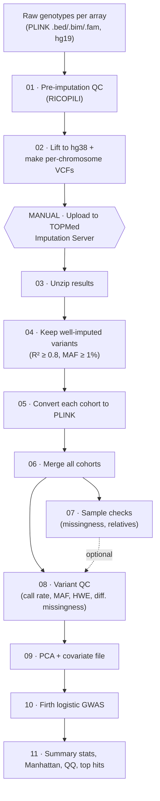

# GWAS Pipeline: TOPMed-imputed, multi-array case/control GWAS

This pipeline takes **raw genotype files from several different genotyping arrays** and produces
**genome-wide association results**: summary statistics, Manhattan and QQ plots, and a table of top hits.

It was built for a **Corticobasal Degeneration (CBD)** GWAS:

| | Samples | Arrays |
|---|---|---|
| Cases | 220 CBD (neuropathologically confirmed) | 2 case batches |
| Controls | 4,878 | 4 control arrays |
| Variants tested | ~4.7 million (TOPMed-imputed, hg38) | |

Everything study-specific (paths, cohorts, thresholds, cluster settings) lives in the `config/` folder,
so the same scripts work for any multi-array case/control study.

---

## Table of contents

1. [The big picture](#1-the-big-picture)
2. [Before you start](#2-before-you-start)
3. [How to run the pipeline](#3-how-to-run-the-pipeline)
4. [Step-by-step guide](#4-step-by-step-guide)
   - [Step 01: Pre-imputation QC](#step-01-pre-imputation-qc-ricopili)
   - [Step 02: Prepare files for TOPMed](#step-02-prepare-files-for-topmed-hg38-liftover)
   - [Manual step: Impute on TOPMed](#manual-step-impute-on-the-topmed-imputation-server)
   - [Step 03: Unzip imputed results](#step-03-unzip-the-imputed-results)
   - [Step 04: Keep well-imputed variants](#step-04-keep-only-well-imputed-variants)
   - [Step 05: Convert each cohort to PLINK](#step-05-convert-each-cohort-to-plink-format)
   - [Step 06: Merge all cohorts](#step-06-merge-all-cohorts)
   - [Step 07: Check samples](#step-07-check-samples-missingness--relatedness)
   - [Step 08: Clean variants](#step-08-clean-variants-variant-qc)
   - [Step 09: Principal components](#step-09-principal-components-and-covariate-file)
   - [Step 10: Association test](#step-10-association-test-firth-logistic-regression)
   - [Step 11: Results, plots and top hits](#step-11-results-plots-and-top-hits)
5. [Trying different QC settings](#5-trying-different-qc-settings)
6. [Helper tools](#6-helper-tools)
7. [Troubleshooting and dataset-specific notes](#7-troubleshooting-and-dataset-specific-notes)
8. [Data protection](#8-data-protection)
9. [Software, citations and license](#9-software-citations-and-license)

---

## 1. The big picture

A GWAS asks, for every common genetic variant in the genome: **is one allele more frequent in cases
than in controls?** To answer this reliably when cases and controls were genotyped on different
arrays, we need to:

1. **Clean** each array's data (remove bad samples and bad SNPs).
2. **Impute**: fill in the millions of variants each array did not measure, using the TOPMed
   reference panel, so all arrays end up with the *same* set of variants.
3. **Merge** the arrays and **clean again**, removing anything that differs between arrays for
   technical rather than biological reasons.
4. **Correct for ancestry and batch** using principal components.
5. **Test** every variant for association with case/control status.



### Steps at a glance

| Step | What it does | Script | Runs as | Time* |
|:---:|---|---|---|---|
| 01 | Clean each array before imputation | `01_preimputation_qc_ricopili.sh` | login node | ~1–2 h / array |
| 02 | Convert to hg38, write VCFs for TOPMed | `02_prepare_topmed_vcfs.sh` | LSF array (1 job / cohort) | < 1 h |
| — | **Impute on TOPMed (website)** | – | manual | hours–days |
| 03 | Unzip TOPMed results | `03_unzip_topmed_results.sh` | LSF array (cohort × chr) | minutes |
| 04 | Keep well-imputed variants | `04_filter_imputed.sh` | LSF array (cohort × chr) | < 1 h |
| 05 | Join chromosomes, convert to PLINK | `05_convert_cohort.sh` | LSF array (1 job / cohort) | 2–6 h |
| 06 | Merge all cohorts | `06_merge_cohorts.sh` | 1 job | 1–3 h |
| 07 | Sample missingness & relatedness report | `07_sample_qc.sh` | 1 job | ~1 h |
| 08 | Variant QC | `08_variant_qc.sh` | 1 job | ~1 h |
| 09 | PCA and covariate file | `09_pca_covariates.sh` | 1 job | < 30 min |
| 10 | Association test | `10_gwas_firth.sh` | 1 job | ~20–60 min |
| 11 | Summary statistics and plots | `11_post_gwas.sh` | 1 job | ~5 min |

\*Rough guide for ~7,600 samples and ~9 M imputed variants on Minerva (Mount Sinai).

---

## 2. Before you start

### 2.1 Software

| Tool | Version used | Used for |
|---|---|---|
| [RICOPILI](https://sites.google.com/a/broadinstitute.org/ricopili/) | 2025 release | pre-imputation QC (step 01) |
| [UCSC liftOver](https://genome.ucsc.edu/cgi-bin/hgLiftOver) + `hg19ToHg38.over.chain.gz` | 24-Jan-2025 | hg19 → hg38 (step 02) |
| [PLINK 1.9](https://www.cog-genomics.org/plink/) | 1.90b6.21 | merging, LD pruning, relatedness |
| [PLINK 2](https://www.cog-genomics.org/plink/2.0/) | v2.00a5.14 | conversion, QC, PCA, GWAS |
| [bcftools / htslib](https://www.htslib.org/) | 1.22 | VCF handling |
| 7-Zip (`7zz`) | p7zip module | opening TOPMed result files |
| R + [`data.table`](https://cran.r-project.org/package=data.table) | 4.4.1 | covariates and plots |
| hg38 reference FASTA (`chr1`, `chr2`, … naming) | – | reference-allele check |
| IBM LSF (`bsub`) | – | running jobs on the cluster |

On Minerva these are all loaded with `module load`. Module names are set in `config/config.sh`.

### 2.2 Get the code and set up your config

```bash
git clone https://github.com/Center-for-ComputationalNeuropathology/GWAS-Pipeline.git
cd GWAS-Pipeline

# your personal copies; these are never uploaded to GitHub
cp config/config.example.sh            config/config.sh
cp config/cohorts.example.tsv          config/cohorts.tsv
cp config/topmed_passwords.example.tsv config/topmed_passwords.tsv
chmod 600 config/topmed_passwords.tsv
```

Then open the three files and edit them as described below.

### 2.3 `config/config.sh`: paths and settings

Every script reads this file. The settings you are most likely to change:

| Setting | Example | What it means |
|---|---|---|
| `PROJECT_DIR` | `/sc/arion/projects/.../CBD_GWAS_ricopili` | where your data lives (outside this repo) |
| `RAW_DIR` | `${PROJECT_DIR}/cohorts` | raw PLINK files, one folder per array |
| `PREP_DIR` | `${PROJECT_DIR}/imputation_prep` | VCFs to upload to TOPMed are written here |
| `IMPUTED_DIR` | `${PROJECT_DIR}/Imputed_files_TopMed` | put the TOPMed downloads here, one folder per cohort |
| `WORK_DIR` | `${PROJECT_DIR}/pipeline_output` | everything made after imputation |
| `SAMPLE_METADATA` | `.../sample_metadata.txt` | phenotype and covariates for each sample |
| `IMPUTE_R2` / `IMPUTE_MAF` | `0.8` / `0.01` | step 04 filters |
| `QC_GENO` / `QC_MAF` / `QC_HWE` | `0.02` / `0.02` / `1e-6` | step 08 filters |
| `QC_DIFFMISS` | `0.05` | step 08 case-vs-control missingness filter |
| `GWAS_COVARS` | `Sex,PC1,PC2,PC3,PC4,PC5` | covariates in the association model |
| `RUN_TAG` | `geno02_maf02_hwe1e6_dm` | name for this set of QC settings, used in output folder names |

### 2.4 `config/cohorts.tsv`: one line per genotyping array

```tsv
#cohort      raw_dir       raw_bfile           qc_prefix              description
CBD          CBD           cbd_69_pheno        cbd_cbd1_eur_sk-qc1    69 new CBD cases (GSA array)
CBD_2        CBD_GWAS_2    v5cbd               cbd_cbd1_eur_sk-qc1    152 Mayo CBD cases
GSA          gsa           gsa_pheno           cbd_gsa1_eur_sk-qc1    GSA-array controls
Illumina     illumina      illumina_pheno      cbd_illu1_eur_sk-qc1   Illumina-array samples
Express      express       express_pheno       cbd_expr1_eur_sk-qc1   Express-array controls
ExpressExome expressExome  expressExome_pheno  cbd_exex1_eur_sk-qc1   ExpressExome-array controls
```

| Column | Meaning |
|---|---|
| `cohort` | short name, used in every output file name **and** as the TOPMed results folder (`IMPUTED_DIR/<cohort>/`) |
| `raw_dir` | folder inside `RAW_DIR` with this array's raw files |
| `raw_bfile` | raw PLINK file name, without `.bed` |
| `qc_prefix` | name RICOPILI gives the cleaned files (see step 01) |
| `description` | free text |

The **first line** is used as the starting point when cohorts are merged.

### 2.5 Sample metadata: who is a case, and the covariates

A whitespace-separated text file with a header row. `FID`, `IID` and `PHENO` are required. Any other
column can be used as a covariate. Example (made-up IDs):

```
FID  IID          CHIP  Age  Sex  PHENO
0    SAMPLE_0001  2     58   2    1
0    SAMPLE_0002  1     71   1    0
0    SAMPLE_0003  NA    NA   2    1
```

| Column | Coding |
|---|---|
| `PHENO` | `1` = case, `0` = control, `NA` = leave out of the GWAS |
| `Sex` | `1` = male, `2` = female |
| `FID` | must match the genotype files. After TOPMed + PLINK2 conversion this is `0` for everyone |

Samples that are genotyped but **not** in this file go through QC but are not tested.

### 2.6 How your data folder should look

```
PROJECT_DIR/
├── cohorts/                         # RAW_DIR
│   ├── gsa/      gsa_pheno.bed/.bim/.fam
│   ├── illumina/ illumina_pheno.bed/.bim/.fam
│   └── ...
├── imputation_prep/                 # PREP_DIR    (made by step 02)
├── Imputed_files_TopMed/            # IMPUTED_DIR (you put TOPMed downloads here)
│   ├── GSA/      chr_1.zip ... chr_22.zip
│   └── ...
└── pipeline_output/                 # WORK_DIR    (made by steps 04-11)
```

---

## 3. How to run the pipeline

**Option A: let the pipeline submit cluster jobs for you** (recommended)

```bash
./run_pipeline.sh 02                  # one step
./run_pipeline.sh 03-11               # a range of steps; each waits for the previous one
./run_pipeline.sh --dry-run 03-11     # just print the bsub commands, submit nothing
```

**Option B: run a single script yourself** (interactive or for debugging)

```bash
bash scripts/08_variant_qc.sh         # single-job steps: no argument
bash scripts/04_filter_imputed.sh 23  # array steps: give the task number
                                      #   (23 = cohort 2, chromosome 1)
```

Logs go to `WORK_DIR/logs/`. Check progress with `bjobs -w | grep cbdgwas`.

**The full run in four commands:**

```bash
scripts/01_preimputation_qc_ricopili.sh all   # 1. clean each array (wait for RICOPILI jobs)
./run_pipeline.sh 02                          # 2. make TOPMed input files
#                                               3. upload to TOPMed, download results (manual)
./run_pipeline.sh 03-11                       # 4. everything else
```

---

## 4. Step-by-step guide

Every step below follows the same layout:
**Why** → **What it does** → **Run** → **Input / Output** → **Example** → **Check before moving on**.

---

### Step 01: Pre-imputation QC (RICOPILI)

**Why**
Imputation uses the SNPs you measured to predict the ones you didn't. A badly genotyped SNP or sample
spreads its errors to all the imputed variants around it. Each array is therefore cleaned **on its
own**, before imputation, while array-specific problems are still easy to see.

**What it does**
Runs RICOPILI's `preimp_dir` on each array and removes:

| Removed | Threshold | Why |
|---|---|---|
| Samples with many missing genotypes | call rate < 98 % | poor DNA quality |
| SNPs with many missing genotypes | call rate < 98 % | poorly performing probes |
| Samples with unusual heterozygosity | \|F<sub>het</sub>\| > 0.2 | contamination or inbreeding |
| Samples whose genetic sex ≠ recorded sex | sex check | sample mix-ups |
| SNPs missing more in cases than controls | difference > 2 % | technical bias |
| SNPs out of Hardy–Weinberg equilibrium | p < 10⁻⁶ (controls), 10⁻¹⁰ (cases) | genotyping errors |

**Run**

```bash
scripts/01_preimputation_qc_ricopili.sh GSA    # one array
scripts/01_preimputation_qc_ricopili.sh all    # all arrays in cohorts.tsv
```

> RICOPILI submits its own cluster jobs, so run this from a **login node**, not through `bsub`.
> The first time, it creates a file called `cbd.names` in the cohort folder. Open it, give the study
> a 5-character name, and run the command again:
> ```
> STUDYNAME  BFILE      QCCYCLE  EXCLUDE
> gsa1       gsa_pheno  1        0
> ```

**Input / Output**

| | Files |
|---|---|
| Input | `RAW_DIR/<raw_dir>/<raw_bfile>.bed/.bim/.fam` (hg19; case/control in the 6th column of `.fam`) |
| Output | `RAW_DIR/<raw_dir>/qc/<qc_prefix>.bed/.bim/.fam` (cleaned data) |
| | `<qc_prefix>.pdf` (QC report) and `<qc_prefix>.meta` (counts before/after) |

**Example** (`qc/cbd_cbd1_eur_sk-qc1.meta`, 69 CBD cases on the GSA array)

```
ncases_preqc    69        ncases_postqc   69
nsnps_preqc     201694    nsnps_postqc    201694
```

**Check before moving on**
- Open the `.pdf` report for each array.
- If a large share of samples failed, investigate before imputing.

---

### Step 02: Prepare files for TOPMed (hg38 liftover)

**Why**
The TOPMed reference panel uses genome build **hg38**, but most array data is in **hg19**. TOPMed
also only accepts **one compressed VCF per chromosome**, sorted, with `chr`-prefixed chromosome
names and with the REF allele matching the hg38 genome.

**What it does**
1. Converts each SNP's position from hg19 to hg38 with `liftOver`. SNPs that cannot be mapped are dropped.
2. Sorts the SNPs and removes duplicates at the same position.
3. Writes one VCF per chromosome and renames `1` → `chr1`.
4. Splits multi-allelic sites and swaps REF/ALT wherever they don't match the hg38 reference
   (`bcftools norm --check-ref ws`).
5. Compresses and indexes each file.

**Run**

```bash
./run_pipeline.sh 02                          # all cohorts at once
bash scripts/02_prepare_topmed_vcfs.sh 3      # only cohort #3 (GSA)
```

**Input / Output**

| | Files |
|---|---|
| Input | `RAW_DIR/<raw_dir>/qc/<qc_prefix>.bed/.bim/.fam` (from step 01) |
| Output | `PREP_DIR/<cohort>/<cohort>_chr1.vcf.gz` … `_chr22.vcf.gz` + `.tbi` ← **upload these** |
| | `<cohort>_unmapped.bed`: SNPs that could not be lifted |

**Example** (GSA cohort log)

```
autosomal input variants: 650522
lifted: 650296  unmapped: 226
```

The first lines of a finished file (`zcat Illumina_chr1.vcf.gz | grep -v "^##" | head -2`):
```
#CHROM  POS     ID          REF  ALT  QUAL  FILTER  INFO  FORMAT  <sample columns ...>
chr1    833068  rs12562034  G    A    .     .       PR    GT      0/1 ...
```

**Check before moving on**
- Only a small fraction of SNPs should be unmapped (here 226 of 650,522, 0.03 %).
- 22 `.vcf.gz` files per cohort.

---

### Manual step: Impute on the TOPMed Imputation Server

**Why**
Each array measures only 200,000–700,000 SNPs, and different arrays measure *different* SNPs.
Imputation uses a large reference panel of whole-genome-sequenced people (TOPMed) to predict
genotypes at hundreds of millions of variants. Afterwards every cohort has the same variants and
they can be combined.

**What to do**

1. Go to **<https://imputation.biodatacatalyst.nhlbi.nih.gov>** and log in.
2. Click **Run → Genotype Imputation (Minimac4)**. Submit **one job per cohort**: never mix arrays in one job.

   | Setting | Choose |
   |---|---|
   | Reference panel | TOPMed (latest release) |
   | Input files | the 22 files `PREP_DIR/<cohort>/<cohort>_chr*.vcf.gz` |
   | Array build | **GRCh38/hg38** |
   | rsq filter | **off** (we filter ourselves in step 04) |
   | Phasing | Eagle v2.4 |
   | Population | vs. TOPMed panel / All |
   | Mode | Quality Control & Imputation |

3. When the job finishes, read the QC report. It lists SNPs excluded for strand or allele problems.
4. Download all `chr_<N>.zip` files into `IMPUTED_DIR/<cohort>/`, using the `wget`/`curl`
   commands shown on the results page.
5. The server emails a password for the zip files. Add it to `config/topmed_passwords.tsv`:
   ```
   GSA	<password from email>
   ```

**Tip:** write down the reference-panel version and job IDs. The original analysis used
Minimac v4.1.6 with full phasing on GRCh38.

---

### Step 03: Unzip the imputed results

**Why**
TOPMed returns password-protected zip files. This step opens them, reading the password from your
private file so it never shows up in job listings, logs or on GitHub.

**What it does**
Extracts every `chr_<N>.zip` for every cohort, one small job each. Chromosomes that are already
unzipped are skipped, so it is safe to rerun.

**Run**

```bash
./run_pipeline.sh 03
```

**Input / Output**

| | Files |
|---|---|
| Input | `IMPUTED_DIR/<cohort>/chr_<N>.zip`, `config/topmed_passwords.tsv` |
| Output | `IMPUTED_DIR/<cohort>/chr<N>.dose.vcf.gz`: imputed genotypes and dosages |
| | `chr<N>.info.gz`: quality information for every variant |

**Example**: one line of `GSA/chr22.info.gz`
```
chr22  10557776  rs1472237084  G  T  .  .  IMPUTED;AF=4.31034e-07;MAF=4.31034e-07;AVG_CS=1;R2=0.000999569
```
`R2` is the imputation quality (0 = useless, 1 = perfect). `MAF` is the minor-allele frequency in
this cohort. This variant is extremely rare and badly imputed, so step 04 will remove it.

**Check before moving on**
- Each cohort folder has `chr1.dose.vcf.gz` … `chr22.dose.vcf.gz`.

---

### Step 04: Keep only well-imputed variants

**Why**
Most imputed variants are very rare or poorly predicted (low R²). Testing them adds noise and false
positives. When cases and controls come from **different arrays**, imputation quality can also
differ between them. Applying the **same strict filter to every cohort** keeps them comparable.

**What it does**
For each cohort and chromosome, keeps variants with:
- **R² ≥ 0.8** (well imputed)
- **MAF ≥ 0.01** (allele seen in at least 1 % of chromosomes in that cohort)

```bash
bcftools view -i "MAF>=0.01 & R2>=0.8" chr17.dose.vcf.gz -Oz -o GSA_chr17_filtered.vcf.gz
```

**Run**

```bash
./run_pipeline.sh 04
```

**Input / Output**

| | Files |
|---|---|
| Input | `IMPUTED_DIR/<cohort>/chr<N>.dose.vcf.gz` |
| Output | `WORK_DIR/filtered_vcf/<cohort>_chr<N>_filtered.vcf.gz` |

**Example**: see how many variants survived:
```bash
scripts/utils/count_imputed_variants.sh
```

**Check before moving on**
- Roughly 7–8 million variants per cohort should remain (see the step 05 table).

---

### Step 05: Convert each cohort to PLINK format

**Why**
PLINK is the standard tool for GWAS QC and testing, and it is much faster with its own binary
format than with VCFs. Variant names must also be **identical across cohorts** so the same variant
lines up when the cohorts are merged.

**What it does**
1. Joins chromosomes 1–22 into one file per cohort.
2. Converts to PLINK2 format, keeping the imputed **dosages**.
3. Renames every variant to `CHR:POS:REF:ALT`, e.g. `17:45948522:C:A`, giving each a unique name that is the same in every cohort.
4. Also writes a PLINK1 "hard-call" version (most likely genotype) for the merge in step 06.

**Run**

```bash
./run_pipeline.sh 05
```

**Input / Output**

| | Files |
|---|---|
| Input | `WORK_DIR/filtered_vcf/<cohort>_chr*_filtered.vcf.gz` |
| Output | `WORK_DIR/per_cohort/<cohort>.pgen/.pvar/.psam` (dosages) |
| | `WORK_DIR/per_cohort/<cohort>_bed.bed/.bim/.fam` (hard calls, used for merging) |

**Example**: samples and variants per cohort after step 04 filtering:

| Cohort | Samples | Variants |
|---|---:|---:|
| CBD | 69 | 7,272,766 |
| CBD_2 | 152 | 7,422,938 |
| GSA | 2,320 | 8,091,298 |
| Illumina | 1,914 | 8,147,473 |
| Express | 1,745 | 8,227,436 |
| ExpressExome | 1,564 | 8,158,630 |

**Check before moving on**
- Sample counts match what you uploaded to TOPMed.
- A cohort with far fewer variants than the others was imputed less well (here CBD, the sparsest
  array). Expect more missing data for its samples after merging.

---

### Step 06: Merge all cohorts

**Why**
Cases and controls are in different cohorts, so they must be combined into a single dataset before
they can be compared.

**What it does**
1. Merges all cohorts, keeping **every** variant found in **any** cohort. A variant missing from a
   cohort becomes "missing" for that cohort's samples. Step 08 removes variants with too much missingness.
2. If a variant has incompatible alleles in different cohorts (PLINK writes these to a `.missnp`
   file), it is removed from all cohorts and the merge is retried automatically.
3. Lists any sample ID that appears in more than one cohort (`duplicate_ids.txt`). PLINK combines
   such samples into one.

**Run**

```bash
./run_pipeline.sh 06
```

**Input / Output**

| | Files |
|---|---|
| Input | `WORK_DIR/per_cohort/<cohort>_bed.*` for every cohort |
| Output | `WORK_DIR/merged/AllCohorts_merged_raw.bed/.bim/.fam` |
| | `WORK_DIR/merged/duplicate_ids.txt` |

**Example**

```
WARNING: 151 IIDs occur in more than one cohort; they will be merged into one sample.
          151 CBD_2,Illumina
merged: 7613 samples, 9094130 variants
```

**Check before moving on**
- Open `duplicate_ids.txt`. Duplicates should be **the same person** genotyped twice (expected
  here, see [notes](#samples-present-in-two-cohorts)), not two people with the same ID.

---

### Step 07: Check samples (missingness & relatedness)

**Why**
Two things about **samples** can bias a GWAS:
- **High missingness**: poorly genotyped samples add noise.
- **Relatives or duplicates**: the test assumes everyone is unrelated. Related samples make
  results look more significant than they are.

**What it does**
1. Calculates the fraction of missing genotypes for every sample.
2. Estimates relatedness (PI_HAT) between every pair of samples, using common, independent SNPs.
3. Writes a list of samples you *could* remove. By default **nothing is removed**; you review the reports.

| PI_HAT | Meaning |
|---|---|
| ~1.0 | same person (duplicate) or identical twin |
| ~0.5 | parent/child or siblings |
| ~0.25 | grandparent, aunt/uncle, half-sibling |

**Run**

```bash
./run_pipeline.sh 07
# to actually remove the flagged samples in step 08:  APPLY_SAMPLE_QC=true  in config.sh
```

**Input / Output**

| Output (`WORK_DIR/sample_qc/`) | Content |
|---|---|
| `sample_missingness.smiss` | missing rate per sample |
| `fail_mind.txt` | samples with > 10 % missing (`QC_MIND`) |
| `related_pairs.genome` | pairs with PI_HAT > 0.2 (`IBD_PIHAT`) |
| `samples_to_remove.txt` | the two lists above combined (one sample per related pair) |

**Example**: `related_pairs.genome`, key columns (made-up IDs and values)
```
FID1  IID1         FID2  IID2         PI_HAT
0     SAMPLE_0101  0     SAMPLE_2207  0.9981    ← duplicate
0     SAMPLE_0412  0     SAMPLE_0413  0.5023    ← first-degree relatives
```

**Why removal is off by default.** After merging, samples from arrays with fewer SNPs have more
missing data. In this dataset **all 69 GSA-array CBD cases** have ~10 % missingness, so a blanket
"remove samples > 10 % missing" rule would delete an entire batch of cases. That missingness is
instead handled **per variant** in step 08 (differential missingness filter).

**Check before moving on**
- Look at `related_pairs.genome`. Remove true duplicates and close relatives by setting
  `APPLY_SAMPLE_QC=true`, or by editing `samples_to_remove.txt` before step 08.

---

### Step 08: Clean variants (variant QC)

**Why**
After merging, some variants are only well measured in some cohorts, are too rare to test
reliably, or show signs of genotyping error. If a variant is mostly missing in **cases** but present
in **controls** (or vice versa), it can look "associated" purely because of which array was used.
This is the most common source of false positives in multi-array GWAS.

**What it does**
Applies four filters in order and records how many variants are left after each:

| # | Filter | Setting | Removes variants that… |
|---|---|---|---|
| a | Call rate | `QC_GENO=0.02` | are missing in > 2 % of samples |
| b | Minor allele frequency | `QC_MAF=0.02` | are too rare (< 2 %) to test with 220 cases |
| b | Hardy–Weinberg | `QC_HWE=1e-6` | have genotype counts implausible for a real variant |
| c | Differential missingness | `QC_DIFFMISS=0.05` | are missing in > 5 % of cases **or** > 5 % of controls |

Alternative call-rate filter: set `QC_SEPARATE_GENO=0.01` to require ≥ 99 % call rate in cases
**and** in controls separately (stricter, replaces `QC_GENO`).

**Run**

```bash
./run_pipeline.sh 08
```

**Input / Output**

| | Files |
|---|---|
| Input | `WORK_DIR/merged/AllCohorts_merged_raw.*`, `SAMPLE_METADATA` |
| Output | `WORK_DIR/qc_<RUN_TAG>/AllCohorts_qc.bed/.bim/.fam` (clean dataset) |
| | `qc_summary.tsv` (counts after each filter), `exclude_diffmiss.txt` (variants removed by filter c) |

**Example**: `qc_summary.tsv` for the CBD data:

```
step          samples   variants
merged_raw    7613      9094130
a_callrate    7613      5958967
b_maf_hwe     7613      5194760
c_diffmiss    7613      4708354
```

The differential-missingness filter removed 486,406 variants. **All** of them were missing too often
in cases and **none** in controls: a batch effect that would otherwise have produced false hits.

**Check before moving on**
- No filter should remove an unexpectedly large share. If (c) removes millions, one case or
  control batch is much less well imputed than the rest.

> Note: the HWE test here uses all samples together. Array-specific HWE in controls was already done in step 01.

---

### Step 09: Principal components and covariate file

**Why**
If cases and controls differ slightly in **ancestry** or in **which array** they were genotyped on,
thousands of variants differ in frequency for reasons unrelated to disease. Principal components
(PCs) summarise these genome-wide differences. Adding them as covariates in step 10 corrects for them.

**What it does**
1. **LD pruning**: keeps a set of roughly independent SNPs (`--indep-pairwise 200 50 0.25`), so PCs
   aren't dominated by a few highly correlated regions.
2. **PCA**: computes the top 10 PCs (`plink2 --pca 10`).
3. **Covariate file**: joins your sample metadata with the PCs (`scripts/build_covariates.R`).
4. **Plots**: PC1 vs PC2 and PC2 vs PC3, coloured by case/control and by array.

**Run**

```bash
./run_pipeline.sh 09
```

**Input / Output**

| | Files |
|---|---|
| Input | `WORK_DIR/qc_<RUN_TAG>/AllCohorts_qc.*`, `SAMPLE_METADATA` |
| Output | `WORK_DIR/qc_<RUN_TAG>/pca.eigenvec`, `pca.eigenval` |
| | `covariates.txt`: input for step 10 |
| | `pca_plots.pdf` |

**Example**: what the script prints:
```
pruned variant set: 228668
metadata samples : 5098
PCA samples      : 7613
merged           : 5098

PHENO (1 = case, 0 = control):
   0    1
4878  220
```
(7,613 samples were genotyped; the 5,098 with a phenotype in the metadata go into the GWAS.)

`covariates.txt` (made-up IDs and values):
```
FID  IID          CHIP  Age  Sex  PC1       PC2       ...  PC10      PHENO
0    SAMPLE_0001  2     58   2    -0.00552  0.00108   ...  0.00084   1
0    SAMPLE_0002  1     71   1    -0.00601  0.00092   ...  -0.00031  0
```

**Check before moving on**
- Open `pca_plots.pdf`. Cases and controls should **overlap**.
- If samples separate into clear clusters by array, include more PCs or `CHIP` in `GWAS_COVARS`.
- Samples far from everyone else may be of different ancestry. Consider removing them.

---

### Step 10: Association test (Firth logistic regression)

**Why**
This is the GWAS itself. For every variant we test whether the number of copies of an allele
(0, 1 or 2) predicts being a case, while adjusting for sex and ancestry/batch PCs.

We use **Firth logistic regression** instead of the standard version because:
- the design is very **unbalanced** (~1 case for every 22 controls), and
- many variants are **low-frequency**.

In these conditions ordinary logistic regression gives biased odds ratios and inflated P-values.
Firth's correction fixes both.

**What it does**

```bash
plink2 --bfile AllCohorts_qc \
  --pheno covariates.txt --pheno-name PHENO --1 \
  --covar covariates.txt --covar-name Sex,PC1,PC2,PC3,PC4,PC5 \
  --covar-variance-standardize \
  --glm firth hide-covar
```

| Option | Meaning |
|---|---|
| `--1` | phenotype is coded 0 = control, 1 = case |
| `--covar-name` | covariates to adjust for (`GWAS_COVARS` in config) |
| `--covar-variance-standardize` | rescales covariates, which helps the model converge |
| `hide-covar` | report only the variant's effect, not each covariate's |

**Run**

```bash
./run_pipeline.sh 10
```

**Input / Output**

| | Files |
|---|---|
| Input | `WORK_DIR/qc_<RUN_TAG>/AllCohorts_qc.*`, `covariates.txt` |
| Output | `WORK_DIR/gwas_<RUN_TAG>/GWAS_<RUN_TAG>_firth.PHENO.glm.firth` |

**Example**: the log confirms what was tested:
```
1 binary phenotype loaded (220 cases, 4878 controls).
6 covariates loaded from covariates.txt.
```

One line of results:
```
#CHROM  POS      ID             REF  ALT  A1  A1_FREQ   OBS_CT  OR       LOG(OR)_SE  P        ERRCODE
1       1083324  1:1083324:A:G  G    A    A   0.435366  5067    0.90743  0.100206    0.33235  .
```
- **OR** (odds ratio) per copy of allele `A1`: > 1 means `A1` is more common in cases, < 1 more common in controls.
- **ERRCODE** `.` means the test succeeded. Rows with an error code (`FIRTH_CONVERGE_FAIL`, `UNFINISHED`) are dropped in step 11.

**Check before moving on**
- The case and control numbers in the log are what you expect.

---

### Step 11: Results, plots and top hits

**Why**
The raw PLINK output is huge and hard to read. This step turns it into files ready to view, share and
upload, and gives you the standard quality checks for a GWAS.

**What it does**
1. **Summary statistics**: clean, compressed, indexed table (failed tests removed), ready for
   [LocusZoom](https://my.locuszoom.org).
2. **Allele frequencies** in cases and in controls separately.
3. **Manhattan plot**: −log10(P) for every variant along the genome.
4. **QQ plot** and **genomic inflation (λ)**: checks whether P-values are inflated overall.
5. **Top hits table**: every variant with P < 10⁻⁵, with its case and control frequencies.

**Run**

```bash
./run_pipeline.sh 11
```

**Output** (`WORK_DIR/gwas_<RUN_TAG>/`)

| File | Content |
|---|---|
| `CBD_GWAS_<RUN_TAG>_hg38_locuszoom.tsv.gz` (+ `.tbi`) | summary statistics (upload to LocusZoom, build GRCh38) |
| `manhattan.png` | Manhattan plot. Red line = genome-wide significance (5×10⁻⁸) |
| `qq.png` | observed vs expected P-values, with λ |
| `lambda.txt` | λ, number of variants, number of genome-wide and suggestive hits |
| `top_hits.tsv` | variants with P < `SUGGESTIVE_P` (default 10⁻⁵) |
| `freq_cases.afreq`, `freq_controls.afreq` | allele frequencies by group |

**Example**: summary statistics:
```
#CHROM  POS       MarkerID         REF  ALT  A1  A1_FREQ   OR        SE        P
1       1083324   1:1083324:A:G    G    A    A   0.435366  0.90743   0.100206  0.33235
1       1095185   1:1095185:C:T    C    T    T   0.16951   0.957364  0.134421  0.745828
```

`top_hits.tsv` columns:
```
MarkerID  CHROM  POS  REF  ALT  A1  A1_FREQ  OR  SE  P  ALT_FREQ_cases  N_ALLELES_cases  ALT_FREQ_controls  N_ALLELES_controls
```

Look at one region:
```bash
tabix CBD_GWAS_<RUN_TAG>_hg38_locuszoom.tsv.gz 17:45000000-46500000
```

**How to read λ (genomic inflation)**

| λ | Interpretation |
|---|---|
| ≈ 1.00–1.05 | no meaningful inflation |
| ≈ 1.05–1.10 | mild, common in imputed multi-array studies |
| > 1.10 | likely residual batch or ancestry effects. Try more PCs, `CHIP` as covariate, or stricter QC |

**Check before moving on**
- The QQ plot follows the diagonal except at the far tail.
- For every top hit, run `scripts/utils/lookup_imputation_quality.sh` to confirm it is well imputed
  in **all** cohorts (see [Helper tools](#6-helper-tools)).

---

## 5. Trying different QC settings

To test whether results are robust, rerun steps 08–11 with different thresholds. Change the values
**and** `RUN_TAG` in `config/config.sh` so earlier results are kept, then:

```bash
./run_pipeline.sh 08-11
```

Settings explored in the original CBD analysis:

| `RUN_TAG` | `QC_GENO` | `QC_SEPARATE_GENO` | `QC_MAF` | `QC_DIFFMISS` | Description |
|---|---|---|---|---|---|
| `geno20_maf01_hwe1e6` | 0.2 | – | 0.01 | – | permissive first pass |
| `geno02_maf01_hwe1e6` | 0.02 | – | 0.01 | – | standard call rate |
| `geno02_maf02_hwe1e6` | 0.02 | – | 0.02 | – | higher MAF for 220 cases |
| **`geno02_maf02_hwe1e6_dm`** | 0.02 | – | 0.02 | 0.05 | **default**: plus differential missingness |
| `sepgeno01_maf01_hwe1e6` | – | 0.01 | 0.01 | – | ≥ 99 % call rate in cases and in controls |

---

## 6. Helper tools

### Count variants before and after the imputation filter

```bash
scripts/utils/count_imputed_variants.sh > imputation_filter_summary.tsv
```
Output columns: `cohort  before_filter  after_filter  pct_retained`.
The TOPMed files are large and not indexed, so for all cohorts submit this with `bsub`.

### Check imputation quality of specific SNPs in every cohort

Use this for every top hit. A signal driven by one poorly imputed cohort is not trustworthy.

```bash
printf "rs242559\t17\t45948522\n" > snps.tsv        # name <tab> chromosome <tab> hg38 position
scripts/utils/lookup_imputation_quality.sh snps.tsv
```
```
label     cohort        chr  pos       ref  alt  MAF        R2        status
rs242559  CBD           17   45948522  C    A    0.0797681  0.999216  typed
rs242559  CBD_2         17   45948522  C    A    0.101536   0.65272   imputed
rs242559  GSA           17   45948522  C    A    0.163364   0.999713  typed
rs242559  Illumina      17   45948522  C    A    0.129308   0.926037  imputed
rs242559  Express       17   45948522  C    A    0.255901   0.970658  imputed
rs242559  ExpressExome  17   45948522  C    A    0.204915   0.957289  imputed
```
In this example the SNP is directly genotyped (`typed`) in two cohorts and well imputed in most others.
In CBD_2 its R² (0.65) is below the 0.8 filter, so it is removed from that cohort in step 04.

---

## 7. Troubleshooting and dataset-specific notes

### Common errors

| Message | Step | Fix |
|---|---|---|
| `Error: ... split chromosome` | 02 | already handled (`--make-pgen sort-vars`) |
| TOPMed: "REF allele mismatch" / "chromosome not found" | upload | `REF_FASTA_HG38` must use `chr1`-style names. Step 02 adds `chr` and checks REF |
| `--new-id-max-allele-len` exceeded | 05 | increase `MAX_ALLELE_LEN` in config, rerun step 05 |
| `*-merge.missnp` | 06 | handled automatically: variants removed and merge retried |
| `could not load index` (bcftools on TOPMed files) | utils | TOPMed dose files are not indexed: `bcftools index chrN.dose.vcf.gz`, or stream them |
| Many `FIRTH_CONVERGE_FAIL` | 10 | usually very rare variants: check the MAF filter and covariates |
| `config not found` | any | `cp config/config.example.sh config/config.sh` |

### CBD_2 (Mayo cases): old genome build and `1/2` alleles

The original CBD_2 files (`v5cbd`) are on genome build **hg18**, not hg19, and use `1`/`2` instead of
`A/C/G/T`. Running step 02 directly would place SNPs at wrong positions, and TOPMed would reject the
alleles. These files were fixed **before** step 02 by borrowing information from the Illumina cohort,
which contains the same people:

1. **Alleles**: match SNPs by rsID and build a `plink --update-alleles` file:
   `rsID  <CBD_2 allele1> <CBD_2 allele2>  <Illumina allele1> <Illumina allele2>`.
   506,569 of 532,308 SNPs matched.
2. **Positions**: take each SNP's hg38 position from the Illumina VCF by rsID. SNPs not in Illumina are dropped.
3. **REF check**: `bcftools norm --check-ref ws -f hg38.fa`, as in step 02.

Because the same individuals are in both files, check the result by genotype agreement
(`plink --bmerge ... --merge-mode 6`) before uploading.

### Samples present in two cohorts

151 CBD cases are in both **CBD_2** and the **Illumina** cohort with identical IDs: the same people
genotyped twice. Step 06 reports them and PLINK merges each pair into one sample. Their merged
genotypes have low missingness (~0.4 %), and their case status comes from `SAMPLE_METADATA`. If you
add cohorts, always check `duplicate_ids.txt`. Two *different* people sharing an ID must be renamed
before step 06.

### Why the 69 GSA-array cases have more missing data

These cases were genotyped on a sparser array (~200,000 SNPs after QC), so fewer variants pass
R² ≥ 0.8 in step 04. After merging they are missing ~10 % of variants, versus < 1 % for other
samples. This is why sample removal is off by default (step 07) and why the differential-missingness
filter (step 08) is on by default.

---

## 8. Data protection

- **No data is stored in this repository**: no genotypes, phenotypes, sample IDs or results.
  `.gitignore` blocks PLINK/VCF files, ID lists, covariate files, logs, your `config.sh`/`cohorts.tsv`
  and the TOPMed password file.
- Keep TOPMed passwords **only** in `config/topmed_passwords.tsv` (`chmod 600`).
- Before every commit, check that only code and documentation are included:
  ```bash
  git status --short
  ```

---

## 9. Software, citations and license

If you use this pipeline, please cite the tools it relies on:

- **RICOPILI**: Lam M. *et al.* RICOPILI: Rapid Imputation for COnsortias PIpeLIne. *Bioinformatics* 36, 930–933 (2020).
- **TOPMed Imputation Server / Minimac4**: Das S. *et al.* Next-generation genotype imputation service and methods. *Nat Genet* 48, 1284–1287 (2016). Taliun D. *et al.* Sequencing of 53,831 diverse genomes from the NHLBI TOPMed Program. *Nature* 590, 290–299 (2021).
- **PLINK 1.9 / 2.0**: Chang C.C. *et al.* Second-generation PLINK: rising to the challenge of larger and richer datasets. *GigaScience* 4, 7 (2015).
- **bcftools / htslib**: Danecek P. *et al.* Twelve years of SAMtools and BCFtools. *GigaScience* 10, giab008 (2021).
- **Firth regression**: Firth D. Bias reduction of maximum likelihood estimates. *Biometrika* 80, 27–38 (1993).
- **liftOver**: Hinrichs A.S. *et al.* The UCSC Genome Browser Database: update 2006. *Nucleic Acids Res* 34, D590–D598 (2006).

### Repository layout

```
GWAS-Pipeline/
├── README.md
├── LICENSE                              # MIT
├── run_pipeline.sh                      # submits steps to LSF, chained
├── config/
│   ├── config.example.sh                # paths, modules, thresholds  → copy to config.sh
│   ├── cohorts.example.tsv              # one row per array            → copy to cohorts.tsv
│   ├── topmed_passwords.example.tsv     # TOPMed zip passwords format  → copy to topmed_passwords.tsv
│   └── chr_rename.txt                   # 1 → chr1, … (used in step 02)
└── scripts/
    ├── lib/common.sh                    # shared helpers (config, logging, cohort lookups)
    ├── 01_preimputation_qc_ricopili.sh
    ├── 02_prepare_topmed_vcfs.sh
    ├── 03_unzip_topmed_results.sh
    ├── 04_filter_imputed.sh
    ├── 05_convert_cohort.sh
    ├── 06_merge_cohorts.sh
    ├── 07_sample_qc.sh
    ├── 08_variant_qc.sh
    ├── 09_pca_covariates.sh
    ├── 10_gwas_firth.sh
    ├── 11_post_gwas.sh
    ├── build_covariates.R               # used by step 09
    ├── plot_gwas.R                      # used by step 11
    └── utils/
        ├── count_imputed_variants.sh
        └── lookup_imputation_quality.sh
```

### License

Released under the [MIT License](LICENSE).

**Maintainer:** Shrishtee Kandoi, Center for Computational Neuropathology, Icahn School of Medicine at Mount Sinai
